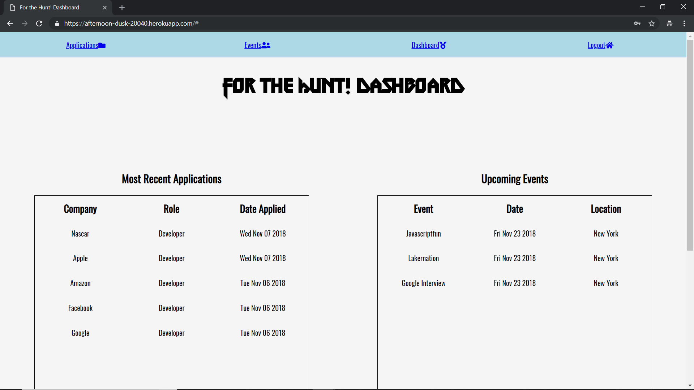
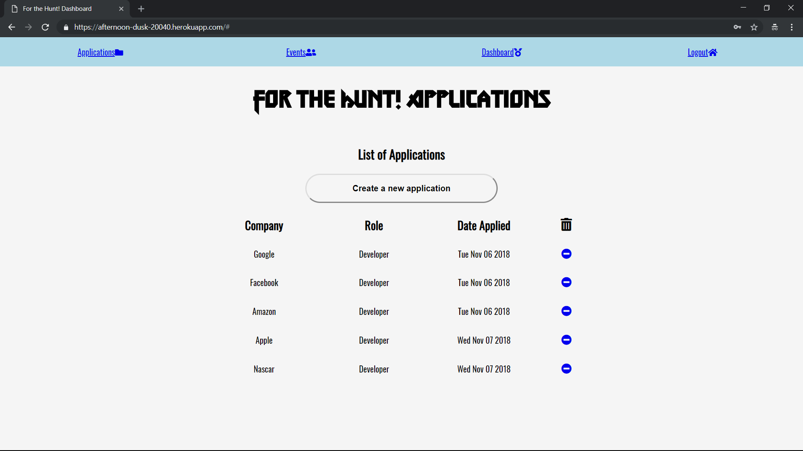
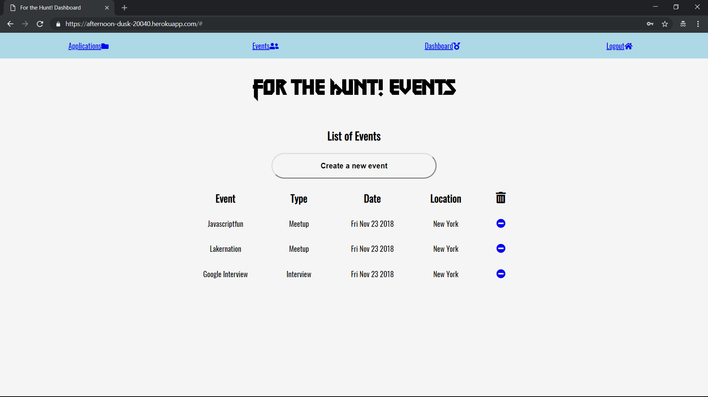
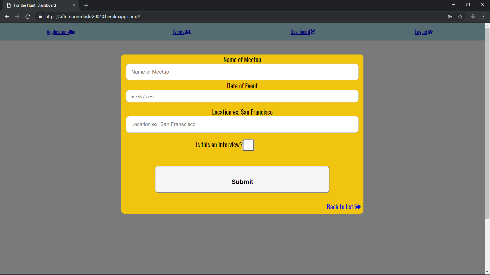

<h1>For the Hunt!</h1>

This app was designed to be a place for the avid job seeker to keep track of the job hunting process. It keeps track of applications filled out and sent, the dates for future interviews and meetup times. The user can sign in and view their own 
specific appliations and interviews in a interactive dashboard that displays the users most recent applications. 

<h2>Link to live app</h2>

https://afternoon-dusk-20040.herokuapp.com/

<h2>Screenshots</h2>

<h3>Homepage Screen </h3>

<h3>Sign Up Screen</h3>

<h3>Login Screen </h3>

<h3>Dashboard Screen</h3>

<h3>List of Applications</h3>

<h3>New Application</h3>

<h3>List of Events</h3>

<h3>New Events</h3>

<h2>API Documentation</h2>

<h3>/user</h3>

<h4>POST</h4>

Creates and validates a new user and stores the new user in the database

<h3>/auth</h3>

<h4>POST</h4>

Validates the correct user and password has been entered, and returns a JWT token for it

<h3>/applications</h3>

<h4>POST</h4>

Creates a new application, and returns the newly created appliation to the user

<h4>GET username/sort</h4>

Returns all applications for a given user by the sorting method used

<h4>GET username</h4>

Returns the last 5 applications applied to from most recent down

<h4>DELETE</h4>

Deletes the selected application based on name and user

<h3>/events</h3>

<h4>POST</h4>

Creates a new event, and returns the newly created event to the user

<h4>GET username/sort</h4>

Returns all events for a given user by the sorting method used

<h4>GET username </h4>

Returns the last 5 event applied to from most recent down

<h4>DELETE</h4>

Deletes the selceted event based on name and user

